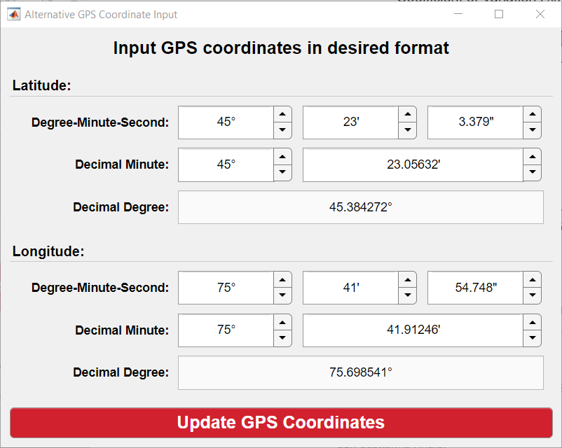
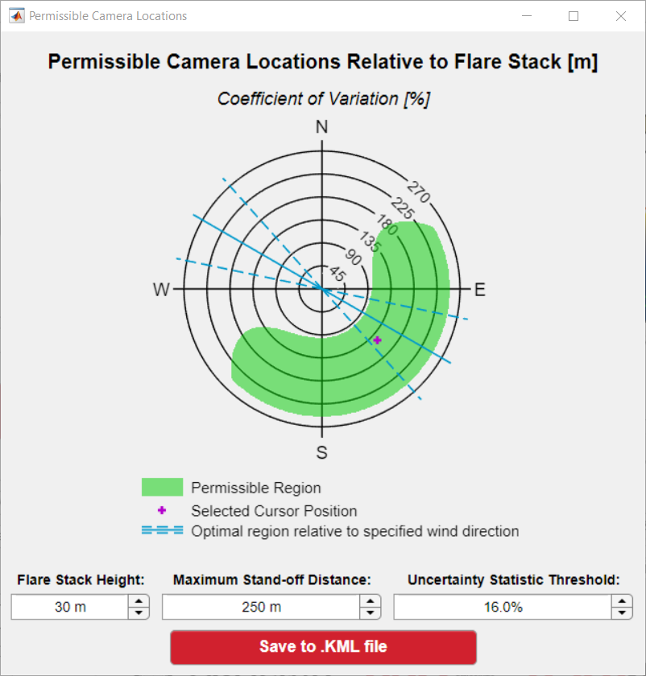

################################
SetupSkyLOSA: Usage Instructions
################################

************
Introduction
************

*SetupSkyLOSA* is intended to support a user in the acquisition of sky-LOSA data. The objective is to enable the user to minimize uncertainties in sky-LOSA-measured soot/black carbon (BC) emission rate, by providing statistics of soot/BC mass column density computed in the general uncertainty analysis. The user must provide information regarding the location, date, and time of the measurement as well as the sky conditions and estimate plume transmittance at the sky-LOSA measurement wavelength. The software then provides a map of a chosen statistic of soot/BC mass column density over the range of camera inclination angles :math:`\beta \in (0,90^\circ)` and camera pointing/bearing relative to north :math:`\alpha_N \in (0,360^\circ)`.

*******
Example
*******

Shown below is an example screenshot of the *SetupSkyLOSA* software. Required inputs are laid out in a logical left-right and top-bottom approach.

*********
Procedure
*********

Loading Statistical Data
========================

Setting the Date and Time
-------------------------

The user has the option to input the date/time manually or allow the software tool to use the cpu time.

.. note::

  Whether manually inputting or allowing the software to compute the current time, the user should confirm that the time zone (i.e., the offset from UTC) is accurate.  For example, Eastern Standard Time is UTC -5.0 and Eastern Daylight Time is UTC -4.0; Central European Time is UTC +1.0 and Central European Summer Time (daylight savings) is UTC + 2.0.

Setting the Measurement Location
--------------------------------

*SetupSkyLOSA* requires the measurement location in latitude and longitude to compute the position of the sun at the current date and time. The default input format for the location is latitude and longitude in decimal degree format - e.g., ##.### N ##.### W. The numeric fields for latitude/longitude are constrained to be positive-valued, with the hemisphere selected by adjacent dropdown menu. This is to avoid uncertainty in whether a hemisphere corresponds to positive or negative coordinates.

Since GPS devices may report location using differing formats (degree-minute-second, decimal minute, or decimal degree), *SetupSkyLOSA* includes a utility that converts location input from common formats into the required decimal degree format. To access the utility, press the **Define using alternative format** button.

Setting the Sky Model
---------------------

The user must select the most appropriate CIE sky model for current conditions. *SetupSkyLOSA* includes the four 'standard' sky models and four additional sky 'groups' tabulated below, which permit consideration of some uncertainty due to the modelling of the skylight intensity distribution.

.. list-table::
  :widths: 15 25 60
  :align: center
  :header-rows: 1

  * - Sky Group
    - Included CIE Sky Models
    - Description
  * - A
    - 1 - 6
    - Overcast and partly cloudy skies with an obscured sun
  * - B
    - 7 - 10
    - Partly cloudy skies with an unobscured sun
  * - C
    - 11 - 15
    - Clear skies (all)
  * - D
    - 11, 13 - 15
    - Clear skies (polluted atmosphere)

Loading Data
------------

Press the red **LOAD DATA** button to load pre-computed statistics for the inputted date and time, location, and sky model.

The currently selected statistic (see `Changing the Plotted Statistic`_) is plotted on the figure axes.

On-the-fly Interaction with Loaded Data
=======================================

Following the loading of data based on the above inputs, the remaining inputs and controls can be used to interact with the loaded data. These inputs/controls are "on-the-fly" in that they do not require the loading of Monte Carlo data.

Changing the Plotted Statistic
------------------------------

Numerous statistics of soot mass column density can be plotted to the figure axes. There are three inputs that control the plotted statistic: 'plotted statistic', 'central tendency', and 'variability'. These inputs control which statistic is plotted to the figure and the metrics of central tendency and variability, respectively.

Defining Imaging Parameters
---------------------------

One additional utility of *SetupSkyLOSA* is the ability to overlay the extent of the image plane on the figure axes (i.e., in :math:`\alpha_N-\beta` coordinates) using a pinhole model. To accomplish this, the software requires:

  1. The 'pitch' (physical dimension) of the pixels in μm.

  #. The focal length of the affixed lens in mm.

  #. The image sensor width and height in number of pixels.

Alternatively, the user can select from a collection of commercially available and sky-LOSA-appropriate camera models.

.. _OTFControls:

On-the-Fly Controls
-------------------

Below the figure axes are four slider bars that allow the user to perturb various inputs and visualization supports:

  1. Plume transmittance (:math:`\tau_{obs}`): an estimate of the observed transmittance of the plume at the measurement wavelength.

  #. Wind direction: the origination or source of local wind measured clockwise from North. If plotted (see `Plot Visibility`_), this shows two ranges optimal camera pointings that are orthogonal to the wind direction, where the ranges' bounds of ±18.2° correspond to 5% out-of-plane motion of the plume.

  #. Plotted contour line: the level/threshold at which contour line(s) are plotted.

  #. Time adjustment: the **local** time at which data are plotted.

Displayed Numeric Outputs
-------------------------

Three sets of numerical output data are provided.

.. list-table::
  :widths: 30 70
  :align: center
  :header-rows: 1

  * - Name
    - Description
  * - Solar Position
    - Shows the local sunrise and sunset for the measurement date, and *current* solar azimuth from North (:math:`\alpha_{sN}`) and zenith angle (:math:`Z_s`) based on the :ref:`"Time Adjustment" <OTFControls>` control
  * - Cursor Position (Current)
    - Shows the camera bearing from North (:math:`\alpha_N`), camera inclination (:math:`\beta`), sun scattering angle (:math:`\theta_s`), and plotted statistic at the **current** cursor position - i.e., when the mouse hovers over the figure axes.
  * - Cursor Position (Selected)
    - Shows the camera bearing from North (:math:`\alpha_N`), camera inclination (:math:`\beta`), sun scattering angle (:math:`\theta_s`), and plotted statistic at the **selected** position, which shows in the figure axes as a purple cross.

Plot Visibility
---------------

Four buttons permit the display or concealment of figure data including the path and position of the sun on the measurement date, data contour(s), image extent, and pointings orthogonal to the wind.

Additional Utilities
====================

"Maximizer"
-----------

The *maximizer* utility permits the user to obtain the maximum relative uncertainty over the :math:`\alpha_N-\beta` domain given a measurement period. This is useful as it allows a user to optimally position the sky-LOSA camera during a predicted measurement period. The utility can be initiated by selecting *File ⭢ "Maximizer": Compute Period Maximum* or by pressing *Ctrl + M*. The software then prompts the user for two inputs, as shown in the screenshot below:

  1. A radio button input prompting the user whether maximization should be performed over the currently selected sky model (default) or over all sky groups.

  #. Two numerical inputs for the time period (in HH:MM) that maximization should be computed.

Upon pressing the "Compute Maximum Uncertainty" button, the software performs the maximization and plots this to the figure axes in the main window.

.. note::

  The maximization procedure may take some time to initialize as data may be loaded. Eventually, a progress bar will predict the remaining time of the procedure.

.. note::

  To reset the data (i.e., to time-dependent / **not** maximized data), press the "Clear Data" button, change one of the column density statistic inputs, or change the plume transmittance slider.

"Positioner"
------------

The *positioner* utility permits the user to obtain viable camera positions given a threshold in the plotted uncertainty data. This utility takes the uncertainty as a function of camera *pointing* and calculates permissible camera *positions* based on user-provided flare stack height, maximum stand-off distance, and uncertainty threshold. The utility can be initiated by selecting *File ⭢ "Positioner": Compute Permissible Camera Locations* or by pressing *Ctrl + P*. The software then prompts the user for the three listed inputs and plots the permissible camera positions, as shown in the screenshot below:

The utility also permits the user to save the positioning data in a Keyhole Markup Language (.kml) file, which can be loaded into software like Google Earth or ArcGIS. Once saved, the utility will also *attempt* to load the created .kml file in Google Earth (PC support only).

.. note::

  The output plot overlays the selected cursor position and the pointings orthogonal to the wind in the figure, if these data are shown in the main application's figure axes.
